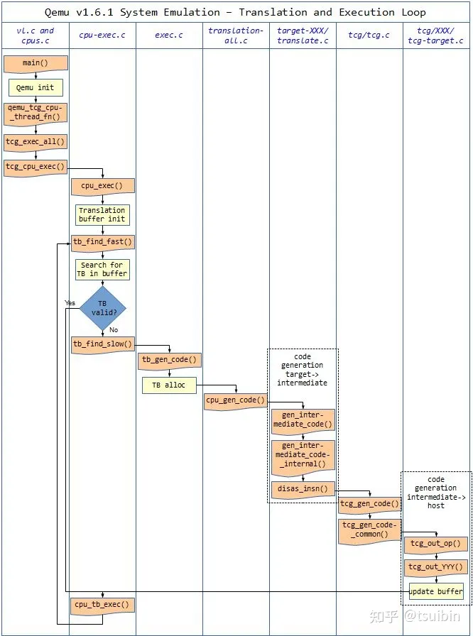

# 二进制翻译进展

* [二进制翻译进展](#二进制翻译进展)
   * [2022-10-05](#2022-10-05)
      * [qemu-user-mode 介绍](#qemu-user-mode-介绍)
      * [Tiny Code Generator(TCG)](#tiny-code-generatortcg)
      * [Intel Houdini 比 QEMU 快在哪里？](#intel-houdini-比-qemu-快在哪里)
      * [计划](#计划)
   * [2022-10-04](#2022-10-04)
   * [2022-09-28](#2022-09-28)
      * [问：大部分安卓软件都是 java 开发的吧，那编译后应该是 java binary code，平台无关的，为什么还需要做翻译呢？](#问大部分安卓软件都是-java-开发的吧那编译后应该是-java-binary-code平台无关的为什么还需要做翻译呢)
      * [安卓组件介绍](#安卓组件介绍)
      * [编译 Android 12](#编译-android-12)
      * [计划](#计划-1)
   * [2022-09-27](#2022-09-27)
      * [BT 入门](#bt-入门)
      * [BT 参考项目](#bt-参考项目)

## 2022-10-05

### qemu-user-mode 介绍

[官网介绍](https://qemu-project.gitlab.io/qemu/user/main.html)

QEMU 既可实现全系统硬件虚拟化，也可在 User Mode 下通过为每个容器提供特定的命名空间实现容器化设计。在 User Mode 下，QEMU 不会模拟所有硬件，而是通过内核代码的 TCG(Tiny Code Generator) 模块对异构应用的二进制代码进行翻译和转换。

### Tiny Code Generator(TCG)

> 参考 https://zhuanlan.zhihu.com/p/392753064

TCG 的作用就是翻译模拟的处理器指令流(被模拟处理器)，然后通过 TCG 后端转换为主机指令流（执行 QEMU 的处理器）。



TCG 定义了一系列 IR (Intermediate Representation)，将已经翻译的代码块放在转换缓存中，并通过跳转指令将源处理器的指令集和目标处理器的指令集链接在一起。当 Hypervisor 执行代码时，存放于转换缓存中的链接指令可以跳转到指定的代码块，目标二进制代码可不断调用已翻译代码块来运行，直到需要翻译新块为止。在执行的过程中，如果遇到了需要翻译的代码块，执行会暂停并跳回到 Hypervisor，Hypervisor 使用和协调 TCG 对需要进行二进制翻译的源处理器指令集进行转换和翻译并存储到转换缓存中。

### Intel Houdini 比 QEMU 快在哪里？

[知乎上一些人的猜测](https://www.zhihu.com/question/48522805)

### 计划

阅读以下内容：

- [微码生成器](https://gitlab.com/qemu-project/qemu/-/blob/master/tcg/README)
- [动态翻译后端](https://gitlab.com/qemu-project/qemu/-/blob/master/docs/devel/tcg.rst)
- [解码器 1](https://gitlab.com/qemu-project/qemu/-/blob/master/docs/devel/decodetree.rst)
- [解码器 2](https://wiki.qemu.org/Documentation/TCG/backend-ops)
- [解码器 3](https://wiki.qemu.org/Documentation/TCG/frontend-ops)
- [StackOverflow 关于 TCG 动态翻译的讨论](https://stackoverflow.com/questions/20675226/qemu-code-flow-instruction-cache-and-tcg)

## 2022-10-04

续写 2022-09-28 的 `编译 Android 12` 。

原计划：android arm64 to x86_64

修改计划：arm64 to x86_64

因为安卓实在太大了，下载编译都需要巨久。而且因为安卓后端本身也是 linux ，所以就先尝试直接在 x86 机器上运行 arm 程序。

计划先看看 qemu user mode ，周末写出一版初步的分析结果。

## 2022-09-28

### 问：大部分安卓软件都是 java 开发的吧，那编译后应该是 java binary code，平台无关的，为什么还需要做翻译呢？

- 大部分软件都有 native 的库
- java 现在也是 art 技术 直接编译成机器码了，不再是 java 虚拟机了（安装 apk 应用时完成所有的翻译工作，直接保存机器码。运行时直接动态加载）
- 每个 so 千差万别，没办法统一接口

### 安卓组件介绍

- [安卓模拟器 emulator 介绍](https://developer.android.com/studio/releases/emulator)
- [安卓通用内核 ACK 介绍](https://source.android.com/devices/architecture/kernel/generic-kernel-image)
- [安卓虚拟设备 AVD 介绍](https://source.android.com/docs/setup/create/avd)

### 编译 Android 12

```sh
# 参考 https://gerrit-googlesource.proxy.ustclug.org/git-repo 安装 repo
# 我是手动下载安装的，没有通过 apt 安装。直接安装会依赖 python2.7 ，然后无法解释一些 python 代码
# repo 会直接执行 python 命令，我的 python 版本是 2.7
# 我手动删掉了别的 Python 版本，只保留了 3.8
# repo 找不到 python ，需要链接一下 pythom3.8
mkdir -p ~/.bin
PATH="${HOME}/.bin:${PATH}" # 需要自行修改 ~/.bashrc
curl https://storage.googleapis.com/git-repo-downloads/repo > ~/.bin/repo
chmod a+rx ~/.bin/repo

sudo apt remove python2.7 --auto-remove # https://blog.csdn.net/weixin_43270713/article/details/106427544
sudo apt remove python3.6 --auto-remove
sudo ln -s /usr/bin/python3.8 /usr/bin/python

mkdir ../android-7.1.0_r3
cd ../android-7.1.0_r3
repo init -u git://mirrors.ustc.edu.cn/aosp/platform/manifest -b android-7.1.0_r3
repo sync -j4 --current-branch --no-tags    # 要下载巨久，顺手记录一个查看网速的命令：nload -u M -m eth0
# 原本打算使用 android-12.0.0_r3 ，因为需要 200g 的磁盘空间，我电脑不够大，所以改成 android-7.1.0_r3
# 如果网络遇到问题的话上 tuna 看看
# android-7.1.0_r3 有大约 30g ，把 c 盘撑爆了。。。
# 删除 wsl ，重新安装 wsl 到 d 盘：https://zhuanlan.zhihu.com/p/419242528
```

### 计划

- 安卓模拟器跑起来
- 分析里面的二进制翻译怎么做的
- 分别编译 rom 和 host 代码

## 2022-09-27

### BT 入门

- binary translation 简称 BT
- [二进制翻译( binary translation )有没有成熟的现实应用？请介绍一下实现方式与性能瓶颈。](https://www.zhihu.com/question/29851229/answer/104193305)
- 下载 IDA ，看了一下 libhoudini 的二进制，完全看不懂

### BT 参考项目

- intel 的 BT 项目：libhoudini（未开源，只有二进制）
- qemu 的 User Mode Emulation
- Google Android Studio 某些包含 google 服务的 AVD 镜像里面自带的 libndk_translation.so(好像有符号 没有被 strip 掉)
- 性能是 houdini > AVD > qemu
- qemu 追求通用性 所以会损失很大的性能
- 看到一个 riscv 到 x64 的库，[sfuzz](https://github.com/seal9055/sfuzz)，暂时完全看不懂，不知道能干啥，以后再看
